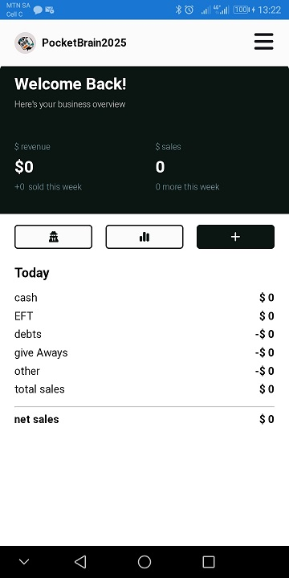
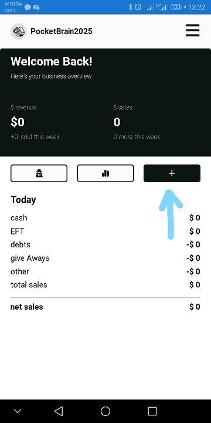
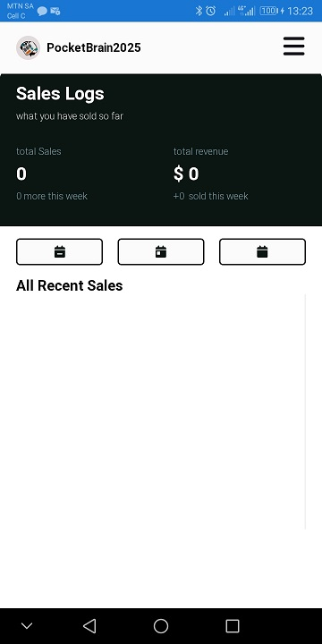
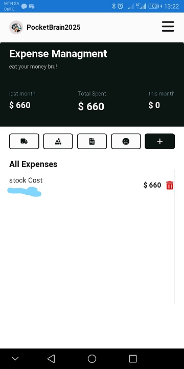

# Pocket_brain2025

A web App for Small bussiness bookkeeping and  Point of sales 
2025 if a completely offline PWA that uses localStorage instead of a database like postgress or mongoDB

#### features

* Track inventory 

* Track expenses 

* Track Debtors and debtor track record

* Make sales and the app automatically tracks inventory and updates accordingly

___

## Installation

Go to www.munya-z.github.io/pocketbrain2025pwa

1. On the top left corner of your broswer press the three dots to reveal the menu

2. locate the __Add to home/ install app__ click and install

3. check your home page for pocketBrain with our logo

___

## Example

## Usage

Run 'cln_code' in the directory containing the files you want to target

### 1. Add items to the inventory

- go to the menu and click inventory

- once there click on `add new`

- fill in the form with information about the item you are adding 

- the **price** here is the price you intend to sale the item at.

- be sure to add the quantity of the item you have available, if you dont have the item now make it zero it can bve edited later.

#### On Availability

* **choose reccuring :** if the item will be stocked again if it finishes 
* **choose while stock lasts:** if the item will finish when the stock avaible is fineshed, meaning that it is of a limited availability. this will erase the item form inventory as soon as it gets to zero units

### 2. Make sale

- go to home page by clicking the App logo on the top left corner
* **make a sale:** Do this by clicking the button with the plus icon in the middle of the screen 
* **select items to sale:** 
1. You will be directed to the new sale page there you will sellect the item from the drop down 

2. and the quantity you want to sale 

3. Press the  `add to cart` button 

4.  once the cart is loaded the sum of the items will be calculated then you will

5. select the payment method and 

6. press `make sale` button to complete the sale.

### 3. view sale logs

* **todays sale logs are on the home page:** they are separated into cash, credit, EFT, and other together with the sum of sales.
* **Press the button with bar gragh:** this will take you to the Sales Logs pages where you can see all sales and can select per day to see day by day sales 
* **Edit sales:** On this page you can **edit credit sales** if they are paid up and also **delete wrong sales** (_this will reverse all the calculations done to your inventory and add back the items which were sold in that sale_). 

### 4. Add and manage Expense

- **Add new expense:** when you pay for anything e.g transport, food, or stock add it here to track how much you are spending

- **Adding more stock to inventory automatically:**
1. when you buy more stock items to add to existing stock

2. just tick the `stock` radio button when you fill in the expenses form and the quatity you add will be added to the inventory

3. make sure to use the same measurement for stock items for more accurate results. for example if you say Apples one by one , its better to add the amount of apples in a box (_e.g 20_) than to say one box Apples when you add expenses.

### 5. Add and manage Debtors

* **Add new debtor:** if someone takes credit for the fisrt time you can add them on the add debtor page or by clicking the `button with a maskot` on the home page.
* **Edit exsiting debtor:** 
1. add new debt instance : if they add on more credit

2. mark debtor as bad: if they dont pay as per agreement 

3. mark debt as paid : Once payment is recieved and debt is cleared 

___

### Foreword

This project was made by @Munya-z. I learnt programming through tutorials and PDFs and I am very happy to share my code with the world. I hope you find it usefull. **Thank you.**
